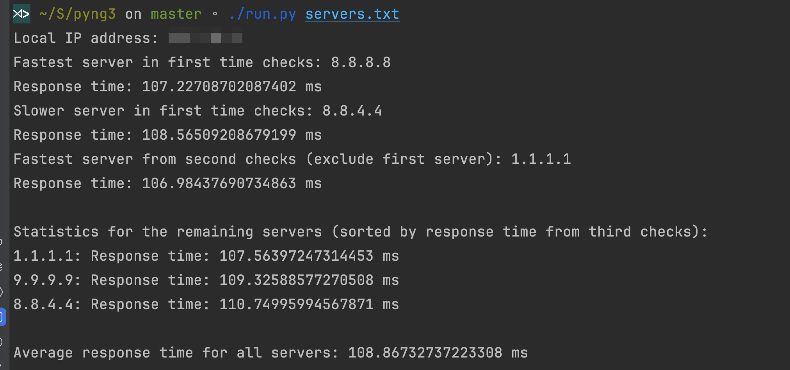

# Pyng3

Acronym for Python and Pyng3 is a Python 3.6+ library that provides ping features.

## Usage

### Install Dependencies

```shell
pip install ping3 tqdm
```
### Run

```shell
./run.py servers.txt 
```
### Output

